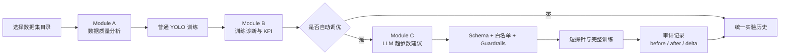

# Auto LabelTrain：YOLO 数据分析、训练诊断与自动调优

[中文](README.md) | [English](README_EN.md)

当前发布版本：`v0.1`

Auto LabelTrain 是一个面向 YOLO 操作人员的本地 Web 工具。它把数据集质量检查、YOLO 训练、训练结果诊断、LLM 超参数建议、安全护栏、训练审计和实验历史整合在同一套界面中。

当前版本适合希望快速回答以下问题的团队：

- 数据集是否存在漏标、类别不平衡、模糊或异常框？
- 一次 YOLO 训练是否过拟合、欠拟合、停滞或过早停止？
- LLM 建议的超参数是否安全，实际训练使用了什么命令？
- 普通训练和自动调优的结果能否在同一处比较和追溯？

> 当前已验证环境：Windows、Python 3.10、Ultralytics YOLOv8 detection。Linux、YOLO11/26、其他视觉任务和模型结构自调整仍在后续计划中。

## 工作流程



## 界面示例

以下截图用于帮助操作人员快速理解核心流程；界面细节可能随版本迭代调整。

### 数据集选择与质量报告


### 训练结果诊断


### 视觉大模型分析


## 当前可用能力

### 数据集分析（Module A）

- 图像模糊、曝光和信噪比检查
- 标注覆盖率、类别分布和长尾分析
- bbox 大小、位置、重叠和异常框分析
- 图像特征聚类与数据质量评分
- 通过文件夹浏览器直接选择数据集目录

### 训练结果诊断（Module B）

- 解析 `results.csv` 和 `args.yaml`
- 提取 mAP50、mAP50-95、Precision、Recall 和 best epoch
- 检测过拟合、欠拟合、训练停滞、NaN 和 Early Stopping 问题
- 可选 DeepSeek 文本诊断和 Qwen-VL 视觉分析
- 自动生成结构化 Module B 报告

### 自动调优（Module C）

- 聚合数据集和训练诊断事实
- 让 LLM 只建议当前版本允许的超参数
- 使用 Schema、参数白名单和 Guardrails 校验候选值
- 先记录精确命令，再以同一命令启动训练
- 使用短 epoch 探针决定继续、重试或终止
- 保存基线、实际参数、训练结果和指标差值

### 统一训练历史

- 普通训练与自动调优共享同一套训练收尾和 KPI 口径
- 按来源、训练状态和分析状态筛选
- 展示四项 KPI、configured/completed/best epoch 和主要参数
- 自动调优详情额外展示 AI 决策、安全护栏和审计入口
- 历史使用原子 JSON 写入和稳定 `run_id` 幂等更新

## 使用前准备

建议配置：

- Windows 10/11
- Anaconda 或 Miniconda
- Python 3.10
- NVIDIA GPU 与可用的 CUDA 环境（推荐；CPU 也可运行，但训练较慢）
- 可访问的 YOLO 格式数据集
- 可选：DeepSeek API Key、Qwen-VL API Key

数据集应包含可被 Ultralytics 识别的 `data.yaml`。模型可使用 Ultralytics 模型名，例如 `yolov8n.pt`；首次使用时 Ultralytics 可能需要联网下载权重，也可以配置本地模型路径。

## 安装

### 方式一：Windows 脚本

在项目根目录运行：

```powershell
.\setup.bat
```

脚本完成后，可使用：

```powershell
.\start_app.bat
```

### 方式二：Conda 命令行

```powershell
conda env create -f environment.yml
conda activate auto_tune
python -m auto_tune.main
```

服务默认地址：

```text
http://127.0.0.1:8000/
```

也可以运行：

```powershell
python start_server.py
```

## 配置

复制配置模板：

```powershell
Copy-Item auto_tune\config.template.yaml auto_tune\config.yaml
```

至少检查以下字段：

```yaml
project:
  name: your-project
  data_yaml: path/to/data.yaml
  model: yolov8n.pt

training:
  default_epochs: 100
  imgsz: 640
  batch: 16
  workers: 4

llm:
  api_key: YOUR_DEEPSEEK_API_KEY
  enabled: false

vision:
  api_key: YOUR_QWEN_API_KEY
  enabled: false
```

没有 API Key 时，将 `llm.enabled` 和 `vision.enabled` 设为 `false`。Python 指标分析、普通训练和 `keep_params` 验证不依赖 LLM。

> `auto_tune/config.yaml` 可能包含密钥和本地路径，已被设计为不提交 GitHub。不要把真实 API Key 写入 README、Issue、日志或截图。

## 操作指南

### 1. 启动界面

```powershell
conda activate auto_tune
python -m auto_tune.main
```

打开 `http://127.0.0.1:8000/`。界面包含项目总览、数据集报告、智能分析、训练监控和历史记录。

### 2. 选择并分析数据集

1. 进入“数据集报告”或“智能分析”。
2. 使用文件夹浏览器选择服务器或本机可访问的数据集目录。
3. 确认目录包含 YOLO 数据和 `data.yaml`。
4. 启动分析并检查标注率、类别分布、图像质量和 bbox 问题。
5. 先处理高严重度问题，再开始正式训练。

目录选择是当前推荐流程；ZIP 上传仅保留兼容能力，不是主要数据接入方式。

### 3. 启动普通训练

1. 在项目设置中确认 `data.yaml`、模型、epoch、batch 和图像尺寸。
2. 进入“训练监控”。
3. 启动训练并观察 SSE 实时日志。
4. 训练完成后查看 mAP50、mAP50-95、Precision、Recall 和 epoch 信息。
5. Module B 会自动生成报告并写入统一实验历史。

如果训练成功但结果分析失败，界面会分别显示训练状态和分析状态，不会把已经成功的训练误报为失败。

### 4. 查看训练诊断

训练报告会解析损失曲线、指标曲线、Early Stopping 和常见训练问题。启用 LLM/视觉模型后，还可以获得文本诊断和混淆矩阵等视觉分析。

不希望产生 API 调用时，请保持：

```yaml
llm:
  enabled: false
vision:
  enabled: false
```

### 5. 启动自动调优

1. 先完成至少一次可用训练，作为参考运行。
2. 进入“智能分析”并选择自动调优。
3. 检查 LLM 诊断和建议参数。
4. 查看 Guardrails 是否接受、裁剪或拒绝候选值。
5. 启动短探针训练；探针通过后继续完整训练。
6. 在历史详情中比较 before、after 和 metric delta。

自动调优不会直接执行任意 LLM 输出。未知参数、非法类型、越界值和不允许的组合会在训练启动前被拦截。

### 6. 查看审计记录

自动调优详情提供审计入口。审计记录包含：

- LLM 原始响应和诊断
- 候选超参数与 Guardrails 结果
- 实际写入的训练参数
- 实际执行的命令数组
- 参考指标、训练后指标和差值
- 探针结论与结构化错误

决策失败、Guardrails 拒绝、训练预检失败或审计持久化失败均为 fatal，不会启动 YOLO 训练。

### 7. 使用统一训练历史

进入“历史记录”后可以：

- 按普通训练或自动调优筛选
- 按完成、失败或取消筛选
- 查看四项 KPI 和 epoch
- 查看主要训练参数与 Module B 报告
- 查看自动调优决策、安全护栏和审计记录
- 导出统一实验历史 JSON

## 测试

Windows 快捷方式：

```powershell
.\run_tests.bat
```

或运行：

```powershell
conda activate auto_tune
python -m pytest auto_tune\tests -q -p no:cacheprovider
```

当前验证结果：

```text
160 passed, 2 warnings
```

两条 warning 来自现有 sklearn PCA 边界数据测试，与训练收尾和审计功能无关。

## 常见问题

### 页面无法访问

- 确认服务进程仍在运行。
- 检查端口 `8000` 是否被其他程序占用。
- 检查终端或 `log/` 中的服务日志。

### 找不到数据集或训练目录

- 使用绝对路径配置 `data.yaml`。
- 确认当前 Windows 用户有目录读取权限。
- 确认训练目录包含 `args.yaml` 和 `results.csv`。

### CUDA 或显存不足

- 减小 `batch` 和 `imgsz`。
- 使用较小模型，例如 `yolov8n.pt`。
- 检查 PyTorch、CUDA 和显卡驱动是否匹配。

### LLM 请求失败

- 检查 Key、endpoint 和网络连接。
- 暂时禁用 `llm.enabled` / `vision.enabled`，先验证本地分析和训练。
- LLM 决策失败时，自动调优会停止，不会绕过安全校验训练。

### 历史或审计写入失败

- 检查 `log/` 的写权限和磁盘空间。
- 系统使用临时文件加 `os.replace` 原子写入，失败时不会用半写入文件替代旧记录。

## 项目结构

```text
auto_tune/
├── main.py                         # 统一入口
├── config.template.yaml            # 安全配置模板
├── modules/
│   ├── dataset_analyzer/            # Module A：数据集分析
│   ├── train_analyzer/              # Module B：训练分析与统一收尾
│   └── agent_engine/                # Module C：决策、护栏、执行、探针和审计
├── ui/
│   ├── app.py                       # FastAPI 后端
│   └── templates/single_page.html   # 单页操作界面
└── tests/                            # 自动化测试

docs/                                # 审查、路线图、规格和实施计划
start_app.bat                         # Windows 启动脚本
run_tests.bat                         # Windows 测试脚本
environment.yml                       # Conda 环境
```

## 当前限制

- 当前为本地、单用户、单机模式。
- 当前稳定支持 YOLOv8 detection。
- JSON 文件仍是主要持久化方式，尚未接入数据库。
- 不支持训练队列、多人隔离、GPU 并发调度或服务重启恢复。
- Linux 迁移仍在计划中。
- YOLO11/26、分类、分割和 OBB 尚未完成全链路验证。
- 当前 LLM 只调整超参数，不修改模型网络结构。

## 路线图

后续主要阶段：

1. 本地基础：YOLO11/26 与 task/version 框架、Linux 迁移、目录分析完善。
2. 在线平台：用户体系、数据隔离、数据库、训练队列和 GPU 调度。
3. 任务扩展：分割、OBB、分类和遗留 YOLOv5 支持。
4. 研究平台：模型结构解析、有限模板组合和结构自调整实验。
5. 可选集成：与 CVAT 解耦协作。

详细内容见：

- [项目路线规划](docs/roadmap_20260814.md)
- [后续实施计划](docs/implementation_plan_20260814.md)
- [统一训练收尾设计](docs/superpowers/specs/2026-08-14-unified-training-finalization-design.md)

## GitHub 安全边界

仓库只应包含源码、测试、配置模板和文档。以下内容不应提交：

- `auto_tune/config.yaml`
- API Key、Token 和本地密钥文件
- 数据集和标注文件
- `.pt` 模型权重
- `detect/`、`runs/` 和训练产物
- `log/`、审计记录和实验历史
- 打包文件、缓存和临时渲染文件

首次发布前请检查 `.gitignore` 和暂存文件列表，避免把本地数据或密钥上传到远程仓库。
