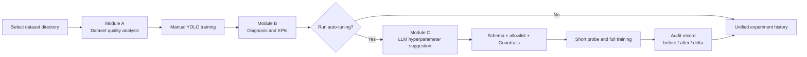

# Auto LabelTrain: YOLO Data Analysis, Training Diagnosis, and Auto-Tuning

[中文](README.md) | [English](README_EN.md)

Current release: `v0.1`

Auto LabelTrain is a local web tool for YOLO operators. It brings dataset quality checks, YOLO training, result diagnosis, LLM-assisted hyperparameter suggestions, safety guardrails, training audits, and experiment history into one interface.

The current version helps teams answer practical questions:

- Does the dataset contain missing labels, class imbalance, blurry images, or abnormal boxes?
- Is a YOLO run overfitting, underfitting, plateauing, or stopping too early?
- Are LLM-suggested hyperparameters safe, and what command was actually executed?
- Can manual training and auto-tuning results be compared and traced in one place?

> Verified environment: Windows, Python 3.10, and Ultralytics YOLOv8 detection. Linux, YOLO11/26, additional vision tasks, and model-structure adjustment remain on the roadmap.

## Workflow



## Interface Examples

These screenshots help operators understand the core workflow. Interface details may evolve between releases.

### Dataset Selection and Quality Report


### Training Result Diagnosis


### Vision-LLM Analysis


## Current Capabilities

### Dataset Analysis (Module A)

- Blur, exposure, and signal-to-noise checks
- Label coverage, class distribution, and long-tail analysis
- Bounding-box size, position, overlap, and anomaly analysis
- Image feature clustering and dataset quality scoring
- Direct dataset directory selection through the folder browser

### Training Diagnosis (Module B)

- Parses `results.csv` and `args.yaml`
- Extracts mAP50, mAP50-95, Precision, Recall, and best epoch
- Detects overfitting, underfitting, plateaus, NaN values, and early-stopping issues
- Optional DeepSeek text diagnosis and Qwen-VL visual analysis
- Automatically creates a structured Module B report

### Auto-Tuning (Module C)

- Aggregates dataset and training facts
- Limits LLM suggestions to supported hyperparameters
- Validates candidates with a Schema, parameter allowlist, and Guardrails
- Audits the exact command before launching that same command
- Uses a short-epoch probe to continue, retry, or abort
- Stores the baseline, actual parameters, results, and metric deltas

### Unified Training History

- Manual training and auto-tuning share one finalization and KPI definition
- Filters by source, training status, and analysis status
- Shows four KPIs, configured/completed/best epochs, and key parameters
- Adds AI decisions, Guardrails, and audit links for tuning runs
- Uses atomic JSON writes and idempotent updates with stable `run_id` values

## Prerequisites

Recommended setup:

- Windows 10/11
- Anaconda or Miniconda
- Python 3.10
- NVIDIA GPU with a working CUDA environment (recommended; CPU is supported but slower)
- A YOLO-format dataset
- Optional DeepSeek and Qwen-VL API keys

The dataset should include a `data.yaml` file accepted by Ultralytics. A model may be specified by an Ultralytics name such as `yolov8n.pt`. Ultralytics may download weights on first use, or you can configure a local model path.

## Installation

### Option 1: Windows Scripts

From the repository root:

```powershell
.\setup.bat
```

After setup:

```powershell
.\start_app.bat
```

### Option 2: Conda CLI

```powershell
conda env create -f environment.yml
conda activate auto_tune
python -m auto_tune.main
```

The default service URL is:

```text
http://127.0.0.1:8000/
```

You may also run:

```powershell
python start_server.py
```

## Configuration

Copy the safe configuration template:

```powershell
Copy-Item auto_tune\config.template.yaml auto_tune\config.yaml
```

Review at least these fields:

```yaml
project:
  name: your-project
  data_yaml: path/to/data.yaml
  model: yolov8n.pt

training:
  default_epochs: 100
  imgsz: 640
  batch: 16
  workers: 4

llm:
  api_key: YOUR_DEEPSEEK_API_KEY
  enabled: false

vision:
  api_key: YOUR_QWEN_API_KEY
  enabled: false
```

Without API keys, set `llm.enabled` and `vision.enabled` to `false`. Python metric analysis, manual training, and `keep_params` verification do not require an LLM.

> `auto_tune/config.yaml` may contain secrets and local paths and is intentionally excluded from GitHub. Never place real API keys in README files, Issues, logs, or screenshots.

## Operator Guide

### 1. Start the UI

```powershell
conda activate auto_tune
python -m auto_tune.main
```

Open `http://127.0.0.1:8000/`. The interface contains Project Overview, Dataset Report, Smart Analysis, Training Monitor, and History.

### 2. Select and Analyze a Dataset

1. Open Dataset Report or Smart Analysis.
2. Use the folder browser to select a dataset directory accessible to the server.
3. Confirm that the directory contains YOLO data and `data.yaml`.
4. Start analysis and inspect label coverage, class distribution, image quality, and bounding-box issues.
5. Resolve high-severity issues before formal training.

Directory selection is the recommended workflow. ZIP upload remains only for compatibility and is not the primary ingestion path.

### 3. Start Manual Training

1. Confirm `data.yaml`, model, epochs, batch size, and image size in project settings.
2. Open Training Monitor.
3. Start training and watch the SSE log stream.
4. After completion, review mAP50, mAP50-95, Precision, Recall, and epoch information.
5. Module B automatically creates a report and writes the run to unified experiment history.

If training succeeds but result analysis fails, the UI keeps training status and analysis status separate instead of incorrectly marking the training as failed.

### 4. Review Training Diagnosis

The report analyzes loss curves, metric curves, early stopping, and common training issues. When LLM and vision providers are enabled, it can also add text diagnosis and visual analysis of items such as the confusion matrix.

To avoid API calls, keep:

```yaml
llm:
  enabled: false
vision:
  enabled: false
```

### 5. Start Auto-Tuning

1. Complete at least one usable reference training run.
2. Open Smart Analysis and select auto-tuning.
3. Review the LLM diagnosis and suggested parameters.
4. Check whether Guardrails accepted, clamped, or rejected the candidates.
5. Start the short probe; a successful probe continues into full training.
6. Compare before, after, and metric delta in run history.

Auto-tuning never executes arbitrary LLM output directly. Unknown parameters, invalid types, out-of-range values, and unsupported combinations are blocked before training starts.

### 6. Review Audit Records

An auto-tuning history entry provides an audit link. The audit contains:

- Raw LLM response and diagnosis
- Candidate hyperparameters and Guardrail results
- Parameters actually written for training
- The exact executed command array
- Reference metrics, post-training metrics, and deltas
- Probe decisions and structured errors

Decision failure, Guardrail rejection, preflight failure, or audit persistence failure is fatal and does not launch YOLO training.

### 7. Use Unified Training History

Open History to:

- Filter manual training and auto-tuning runs
- Filter completed, failed, or cancelled runs
- Review four KPIs and epoch information
- Review key parameters and Module B reports
- Review tuning decisions, Guardrails, and audit records
- Export unified experiment history as JSON

## Testing

Windows shortcut:

```powershell
.\run_tests.bat
```

Or run:

```powershell
conda activate auto_tune
python -m pytest auto_tune\tests -q -p no:cacheprovider
```

Current verified result:

```text
160 passed, 2 warnings
```

The two warnings come from existing sklearn PCA boundary-data tests and are unrelated to training finalization or auditing.

## Troubleshooting

### The UI Is Not Reachable

- Confirm that the server process is still running.
- Check whether port `8000` is already in use.
- Review terminal output or service logs under `log/`.

### Dataset or Training Directory Is Not Found

- Configure an absolute path to `data.yaml`.
- Confirm that the current Windows user can read the directory.
- Confirm that a training directory contains `args.yaml` and `results.csv`.

### CUDA or GPU Memory Error

- Reduce `batch` and `imgsz`.
- Use a smaller model such as `yolov8n.pt`.
- Verify that PyTorch, CUDA, and the GPU driver are compatible.

### LLM Request Fails

- Check the API key, endpoint, and network connection.
- Disable `llm.enabled` / `vision.enabled` and verify local analysis and training first.
- A failed LLM decision stops auto-tuning instead of bypassing safety checks.

### History or Audit Cannot Be Written

- Check write permissions and available disk space for `log/`.
- The system uses a temporary file plus `os.replace` for atomic writes, so a failed write does not replace an existing record with a partially written file.

## Project Structure

```text
auto_tune/
├── main.py                         # Unified entry point
├── config.template.yaml            # Safe configuration template
├── modules/
│   ├── dataset_analyzer/            # Module A: dataset analysis
│   ├── train_analyzer/              # Module B: diagnosis and shared finalization
│   └── agent_engine/                # Module C: decisions, Guardrails, execution, probe, audit
├── ui/
│   ├── app.py                       # FastAPI backend
│   └── templates/single_page.html   # Single-page operator UI
└── tests/                            # Automated tests

docs/                                # Reviews, roadmap, specifications, and plans
start_app.bat                         # Windows launcher
run_tests.bat                         # Windows test launcher
environment.yml                       # Conda environment
```

## Current Limitations

- The current deployment is local, single-user, and single-machine.
- YOLOv8 detection is the currently stable task.
- JSON files remain the primary persistence layer; no database is connected.
- Training queues, multi-user isolation, concurrent GPU scheduling, and restart recovery are not available.
- Linux migration remains planned.
- YOLO11/26, classification, segmentation, and OBB have not completed full-pipeline validation.
- The current LLM changes hyperparameters only; it does not modify the model network structure.

## Roadmap

Planned stages:

1. Local foundation: YOLO11/26 and task/version framework, Linux migration, and directory-analysis improvements.
2. Online platform: user accounts, data isolation, database, training queue, and GPU scheduling.
3. Task expansion: segmentation, OBB, classification, and legacy YOLOv5 support.
4. Research platform: model-structure parsing, constrained template combinations, and structure-adjustment experiments.
5. Optional integration: decoupled collaboration with CVAT.

Detailed documents:

- [Project Roadmap (Chinese)](docs/roadmap_20260814.md)
- [Implementation Plan (Chinese)](docs/implementation_plan_20260814.md)
- [Current Development Handoff (Chinese)](docs/development_handoff_20260814.md)
- [Operator Manual (Chinese)](docs/%E6%93%8D%E4%BD%9C%E8%AF%B4%E6%98%8E_%E6%93%8D%E4%BD%9C%E5%B7%A5%E6%89%8B%E5%86%8C.md)

## GitHub Safety Boundary

The repository should contain source code, tests, configuration templates, and documentation only. Do not commit:

- `auto_tune/config.yaml`
- API keys, tokens, or local secret files
- Datasets and annotations
- `.pt` model weights
- `detect/`, `runs/`, or training artifacts
- `log/`, audit records, or experiment history
- Packages, caches, or temporary rendered files

Before the first publish, review `.gitignore` and the staged file list to prevent local data or secrets from reaching the remote repository.
